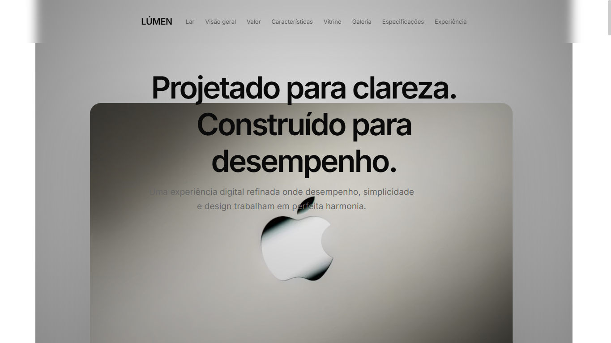
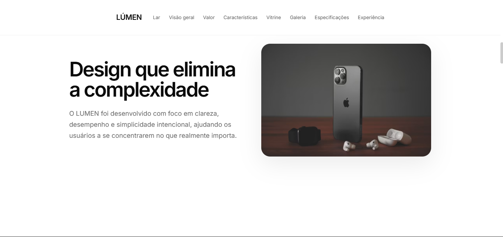
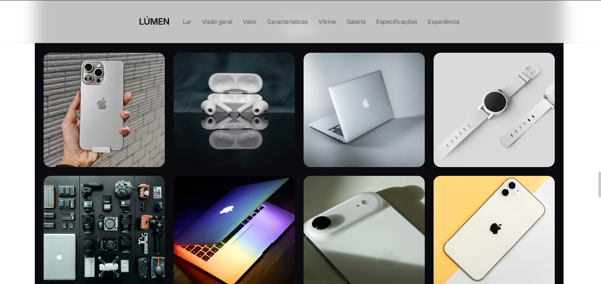
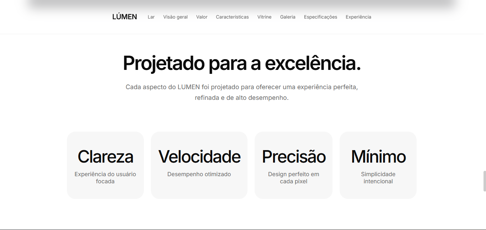

# 🍎 LUMEN — Apple-inspired Landing Page

Uma landing page moderna e minimalista inspirada no design da Apple, construída com React, TypeScript, Vite e Framer Motion.

---

## ✨ Sobre o projeto

O **LUMEN** é um projeto de portfólio focado em design premium, animações suaves e experiência de usuário fluida.
O objetivo é simular uma página de produto real com narrativa visual e scroll cinematográfico.

---

## 🧠 Conceito

Este projeto explora:

* Design minimalista inspirado na Apple
* Hierarquia visual forte
* Scroll storytelling (experiência guiada)
* Animações suaves e microinterações
* Parallax leve e transições fluidas

---

## 🛠️ Tecnologias

* React
* TypeScript
* Vite
* Framer Motion
* CSS moderno (Flexbox + Grid)

---

## 📁 Estrutura do projeto

```text
src/
 ├── components/
 │    ├── Navbar
 │    ├── Hero
 │    ├── Overview
 │    ├── Value
 │    ├── Features
 │    ├── Showcase
 │    ├── Specs
 │    ├── CTA
 │    └── Footer
 ├── styles/
 └── App.tsx
```

---

## 🎯 Features

* 🎬 Animações suaves com Framer Motion
* 📱 Layout responsivo
* 🧭 Navegação por scroll (anchor links)
* 🖼️ Galeria e vitrine de imagens
* 🌊 Efeito parallax leve
* 🍎 UI inspirada em produto Apple

---

## 📸 Preview

### Hero


### Overview


### Gallery


### CTA

---

## ⚙️ Como rodar o projeto

```bash
# clonar repositório
git clone https://github.com/rafaelbarreto95/apple-inspired.git

# entrar na pasta
cd lumen

# instalar dependências
npm install

# rodar projeto
npm run dev
```

---

## 🌐 Deploy

* Netlify - [https://inspirado-na-maca-mordida.netlify.app/#value](https://inspirado-na-maca-mordida.netlify.app/#value)

---

## 👤 Autor

**Rafael Barreto**

* LinkedIn:
  [https://www.linkedin.com/in/rafael-barreto-silva/](https://www.linkedin.com/in/rafael-barreto-silva/)

* Instagram:
  [https://www.instagram.com/rafael_barreto95/](https://www.instagram.com/rafael_barreto95/)

---

## 💡 Objetivo

Este projeto faz parte do meu portfólio como desenvolvedor Front-End, com foco em:

* Interfaces modernas
* Experiência do usuário
* Animações e interatividade
* Design system inspirado em produtos reais

---

## ⭐ Status

🚧 Em evolução contínua — melhorias constantes em UI/UX e performance.

